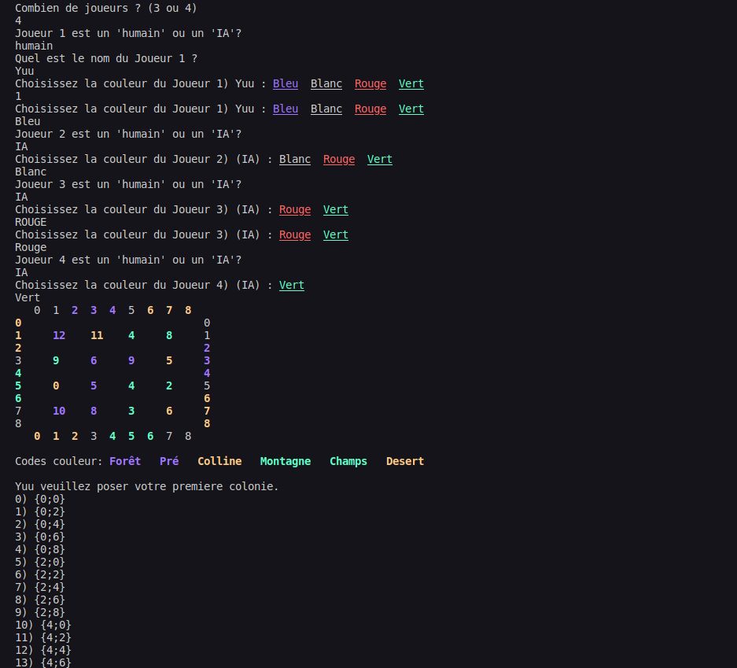
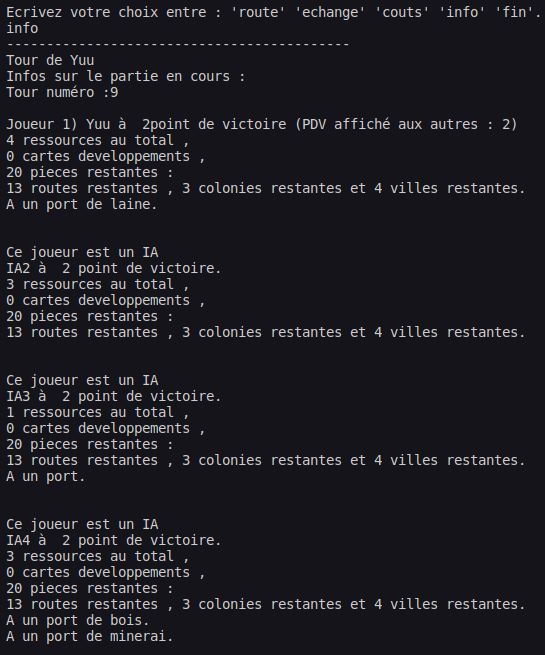
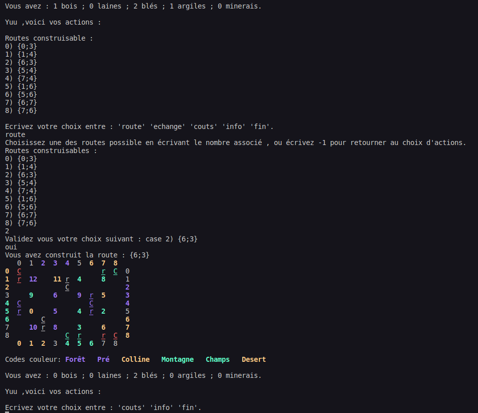
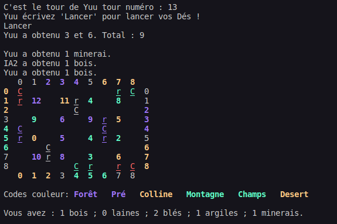

# CataneJava (Projet POOIG 2021)

## Presentation
Adaptation en terminal du jeu de plateau les Colons de Catane.

## Images







## Auteurs
- Henri TRAN
- Adrien LE NINIVEN

## Installation
***IMPORTANT***: Avant toute manipulation, veuillez vérifier que votre terminal / le terminal de votre IDE supporte les **séquences d'échappement ANSI** (ANSI escape code)
afin que les couleurs appraissent bien dans le terminal, sinon l'affichage sera bugée et le jeu injouable.

Si vous êtes sur Eclipse: 
- Installer *ANSI Escape in Console*: help > eclipse market place> ANSI Escape in Console
- Modifier les préférences: window > preferences > run/debug > console > décocher "limit console output"

1. Compiler le fichier Jeu.java
```
javac Jeu.java
```
2. Exécuter Jeu
```
java Jeu
```
